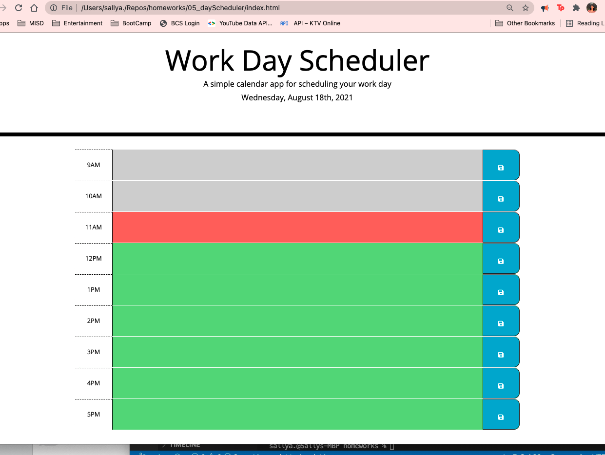
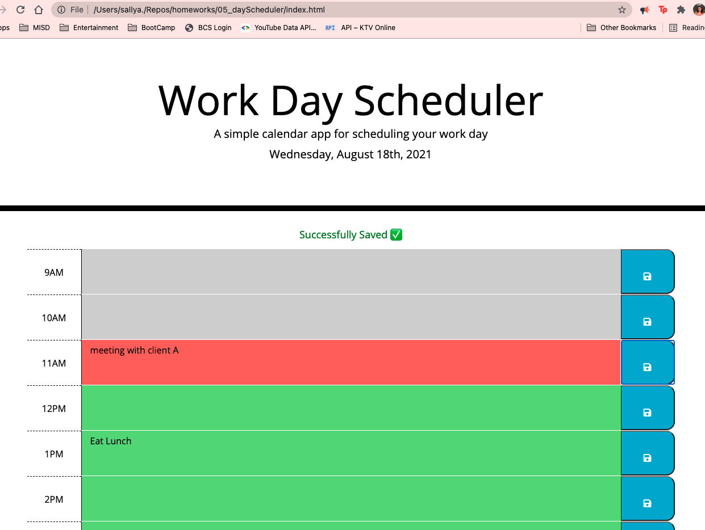

# **Work Day Scheduler | Homework 05**
#### By Sally Alvarenga 🌺,
---
## Task and Expectation
In this assignment I was expected to render an existing code to create a tool that would allow a user to keep track of their work day events by adding them to a a work day scheduler. 

The User is expected:
* To be able to load my deployment page 
* To be able to see the current day and time at the top of my page and time blocks for the work day.
* to see each time block as a different color coded to indicate whether that block of time is in the past, present, or future.
* To be able to input text into the time blocks and save the information to local storage.
* When user refreshes the page, the events of the day are still there. 
---

## Results
You can View my Deployed Portfolio Here: https://salvarenga74.github.io/Work-Day-Scheduler_HW05/

I met the accepted criteria of this assignment and have gone written a beautiful js script page (in my opinion). I have taken care that all of my code follows a logical path and is easy to read and understand the purpose for the sections of code according to use.

The Day scheduler has a clean user interface that looks almost exactly to what the user expected to see based on the example. Includes current date and time displayed at the header, color coated time blocks to represent what hour it is, and save icons on all of the time boxes.

My Day Scheduler also collects user input for all the time blocks and and stores the values. The save button saves all the inputted events on the page.

---
© 2021 Sally Alvarenga 🌺, LLC.
Confidential and Proprietary. All Rights Reserved. 